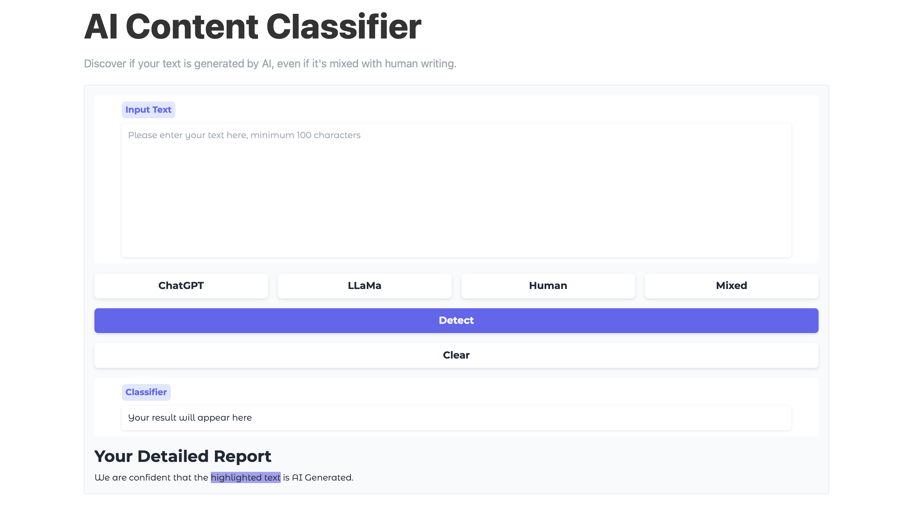

# AI Content Detector

AI Content Detector is a tool designed to classify text as either AI-generated or human-written. 


## Demo

Online demo is available! Click below to try AI Content Detector

[](https://zeroai.haozheli.com)

## Features

- **Easy to Use**: Get your result instantly and review it easily. AI-generated content will be highlighted for quick identification.
- **Universal Compatibility**: Works with most AI models, including GPTs, LLaMas, Claude, GroK, QWen, GLMs, and more.
- **High Accuracy**: Duo algorithm ensures accuracy higher than 98% in on LLaMa 3 8b Model.
- **Free to Use**: No limitations, no hidden fees, and no ads ever.

## Installation

1. **Clone the repository**:
    ```sh
    git clone https://github.com/Haozhe-Li/AI-Content-Classifier.git
    cd ai-content-detector
    ```

2. **Create a virtual environment**:
    ```sh
    python -m venv venv
    source venv/bin/activate  # On Windows use `venv\Scripts\activate`
    ```

3. **Install the dependencies**:
    ```sh
    pip install -r requirements.txt
    ```

5. **Run the application**:
    ```sh
    python3 app.py
    ```

Your AI Content Detector should now be up and running at `localhost:7680`. 

## Usage

To use the AI Content Detector, follow these steps:

1. **Input Text**:
    - Open the application in your browser.
    - Enter the text you want to analyze in the provided text box.

2. **Analyze**:
    - Click the "Detect" button to start the classification process.
    - Wait for the analysis to complete. This usually takes a few seconds.

3. **Review result**:
    - The result will be displayed on the screen.
    - An likelihood score between 0-1 will be given.
    - AI-generated content will be highlighted for easy identification.
    - A detailed report will be provided, showing the likelihood of the text being AI-generated or human-written.

## Contributing

We welcome contributions to improve the AI Content Detector. To contribute, please follow these steps:

1. **Fork the repository**:
    - Click the "Fork" button on the GitHub repository page.

2. **Create a new branch**:
    ```sh
    git checkout -b feature-branch
    ```

3. **Make your changes**:
    - Implement your feature or fix a bug.

4. **Commit your changes**:
    ```sh
    git commit -m "Description of your changes"
    ```

5. **Push to your branch**:
    ```sh
    git push origin feature-branch
    ```

6. **Create a pull request**:
    - Go to the GitHub repository and click "New pull request".

## License

This project is licensed under the MIT License. See the [LICENSE](LICENSE) file for more details.

## Contact

For any questions or feedback, please open an issue on the GitHub repository or contact us at [Haozhe.Li](https://haozhe.li/#contact)
